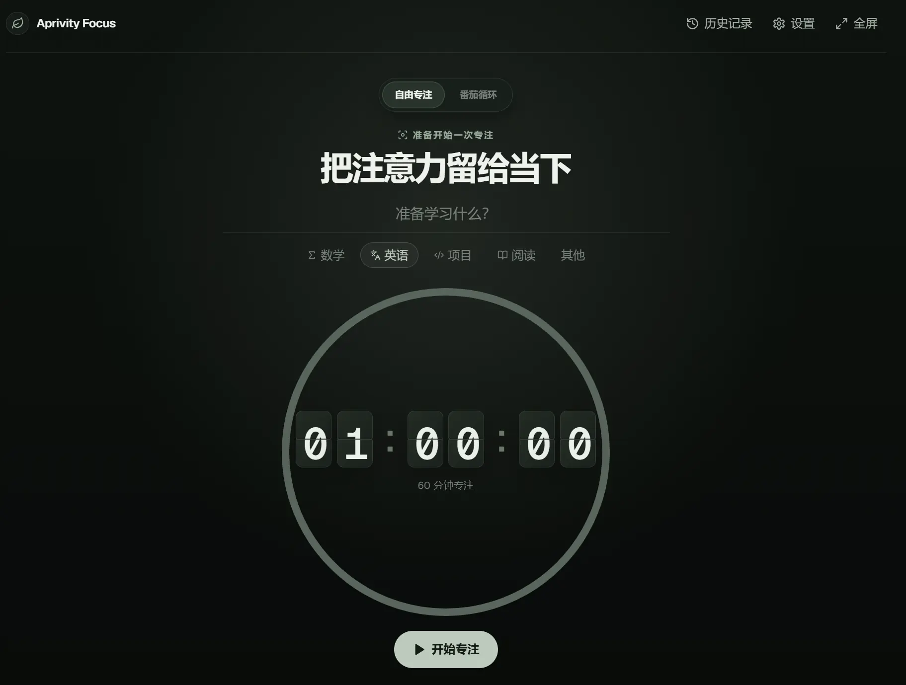
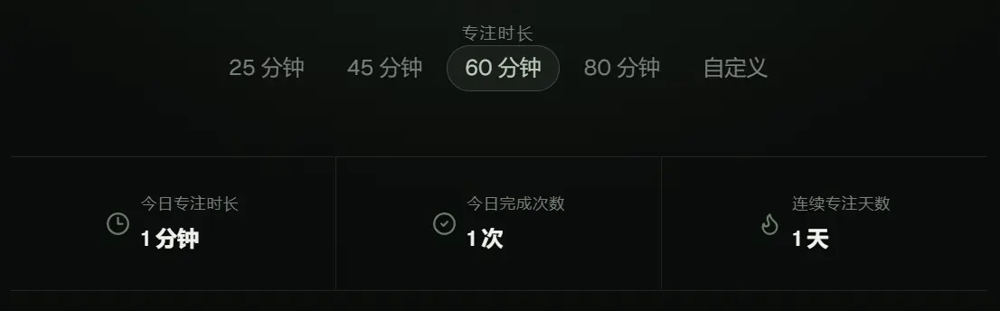
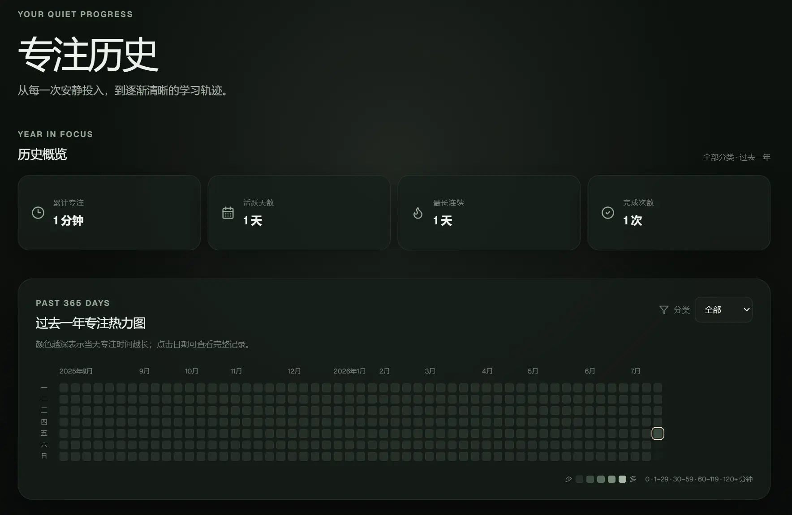
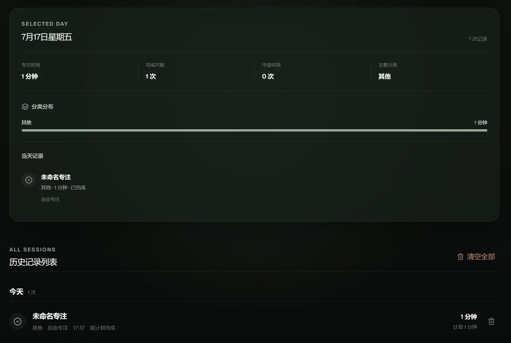
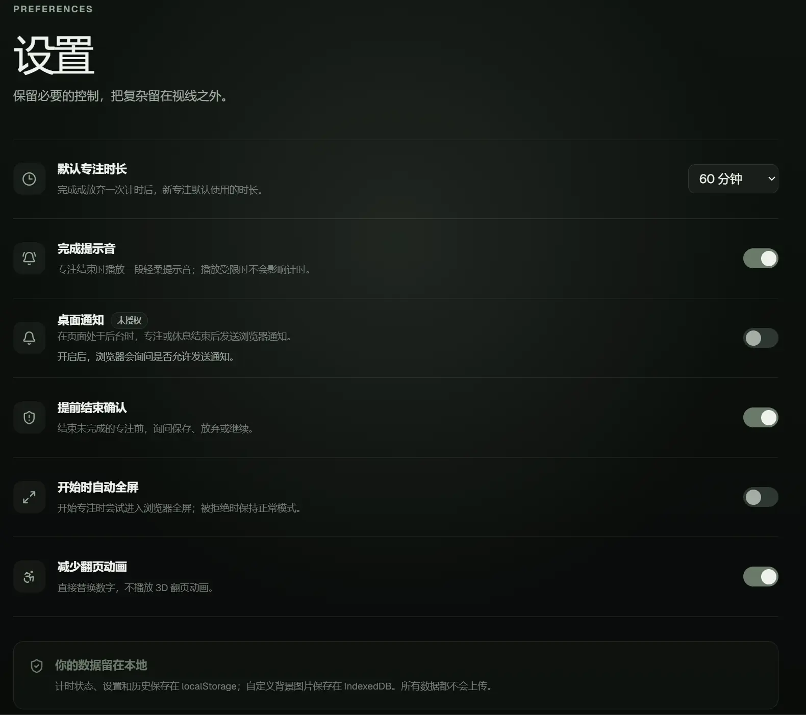
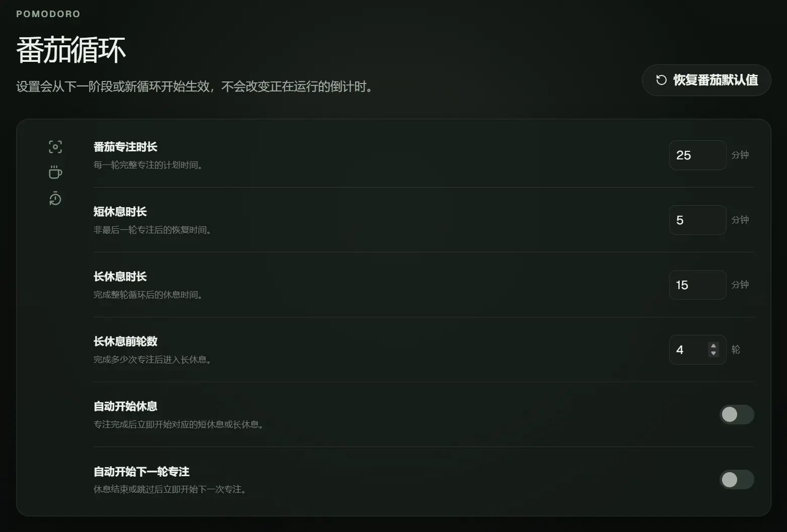
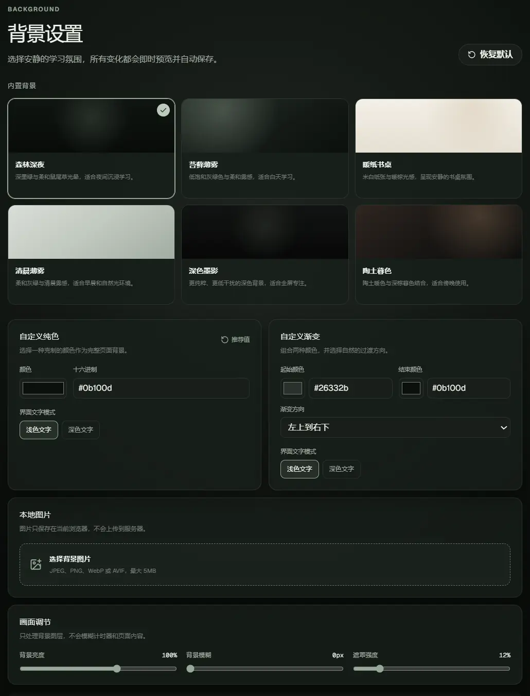

# Aprivity Focus

Aprivity Focus 是一个面向学生和个人学习场景的沉浸式倒计时网页。它采用安静克制的 Forest Sage 视觉语言，围绕“填写任务 → 选择时长 → 专注 → 保存记录 → 查看统计”的单一流程设计。

> V1 完全运行在浏览器中，不需要账号、后端或数据库。

## 在线访问

GitHub Pages 地址：[https://aprivity.github.io/study-timer/](https://aprivity.github.io/study-timer/)

部署工作流合并到 `main` 并首次成功运行后，该地址开始提供服务。

## 功能

- 基于结束时间戳计算的准确倒计时，降低后台标签页限频造成的误差
- 开始、暂停、继续、提前结束与完成闭环
- 自由专注与番茄循环双模式，支持专注、短休息和长休息自动流转
- 番茄阶段时长、长休息前轮数及自动开始规则可配置
- 当前轮次、下一阶段和轮次进度提示，休息可随时跳过
- 刷新后恢复运行中、暂停中和已完成的计时器
- 原生 SVG 圆环进度，末尾 10% 进入陶土色提醒状态
- 原生 CSS 3D 翻页时钟，支持 `MM:SS` 和 `HH:MM:SS`
- 25、45、60、80 分钟预设与 1–720 分钟自定义时长
- 任务名称和数学、英语、项目、阅读、其他分类
- localStorage 学习记录，完成记录 UUID 防重复写入
- 今日专注时长、完成次数和连续专注天数统计
- 过去 365 天专注热力图、历史概览、共享分类筛选和单日详情
- 按日期分组的历史列表，以及二次确认后的单条删除和清空全部
- 默认时长、提示音、提前结束确认、自动全屏和减少动画设置
- 可选浏览器桌面通知，在后台标签页中提醒专注完成和休息结束
- 六种内置学习背景，覆盖深色夜间、浅色纸张和清晨雾感等场景
- 自定义纯色、双色渐变与仅存于本地的图片背景
- 背景亮度、遮罩、模糊、图片缩放、显示方式和位置调节
- 带预览、合并、覆盖、恢复点和撤销能力的版本化 JSON 本地备份
- 深浅色界面自动适配，背景设置刷新和页面导航后保持
- 动态网页标题与手动全屏专注模式
- 响应式桌面/移动布局、键盘焦点样式和减少动画模式

## 技术栈

- Next.js 16 App Router
- React 19、TypeScript 严格模式
- Tailwind CSS 3、原生 CSS
- Lucide React
- 原生 SVG 与 CSS 3D Transform / Keyframes
- Vitest、React Testing Library、jsdom

## 背景系统

背景由独立的固定图层渲染，不参与页面布局，也不会随着倒计时每秒重新计算。六个内置预设如下：

| 背景 | 风格 | 界面模式 |
| --- | --- | --- |
| 森林深夜 | 深墨绿、夜间专注 | 深色 |
| 苔藓薄雾 | 灰绿、白天学习 | 深色 |
| 暖纸书桌 | 米白、纸张与书桌感 | 浅色 |
| 清晨薄雾 | 低饱和灰绿、清晨氛围 | 浅色 |
| 深色墨影 | 极简深色、低干扰 | 深色 |
| 陶土暮色 | 暖棕陶土、傍晚氛围 | 深色 |

在设置页还可以：

- 使用颜色选择器或合法十六进制值创建纯色背景
- 组合两个颜色并选择垂直、水平、对角或径向渐变
- 上传 JPEG、PNG、WebP 或 AVIF 图片，单张最大 5MB
- 调整背景亮度、模糊、遮罩，以及图片缩放、位置和显示方式
- 为自定义背景手动选择浅色文字或深色文字模式
- 一键确认恢复默认背景，并删除浏览器中保存的自定义图片

设置变更会即时预览并自动保存，不需要额外点击保存。

## 番茄循环模式

首页可以在没有活动计时任务时切换“自由专注”和“番茄循环”。自由专注完整保留原有预设、自定义时长、提前结束与恢复行为；番茄循环复用同一个时间戳倒计时，在其上增加独立的阶段状态机。

默认流程：

```text
25 分钟专注
→ 5 分钟短休息
→ 重复 4 轮
→ 15 分钟长休息
→ 新一轮循环
```

番茄设置支持：

- 专注 1–180 分钟
- 短休息 1–60 分钟
- 长休息 1–120 分钟
- 长休息前 2–12 轮专注
- 可选自动开始短休息和长休息
- 可选自动开始下一轮专注
- 单独恢复番茄默认参数，不影响自由专注或背景设置

每个完整专注阶段保存为一条独立历史记录，并显示“番茄 · 第 N/M 轮”。休息阶段不创建 `FocusSession`，不会进入今日专注时长或完成次数。提前结束专注并选择保存时记录为 `stopped`，随后结束当前循环，避免把不完整专注算作完成轮次。

模式、阶段、当前轮次、循环 ID、剩余时间和结束时间戳都会保存在浏览器中。运行中或暂停中刷新、进入历史/设置后返回，都会恢复原阶段；后台过期阶段只处理一次。旧版自由专注计时状态会自动迁移为 V2 的 `free` 模式，无需清理 localStorage。

## 浏览器桌面通知

桌面通知是可选功能，只在页面处于后台时发送；页面可见时继续使用原有提示音、完成弹窗和阶段提示，避免重复提醒。当前覆盖：

- 自由专注正常完成
- 番茄专注阶段完成，包括最后一轮进入长休息
- 短休息结束
- 长休息结束

开启路径：`设置 → 桌面通知 → 确认浏览器权限`。首次打开页面、开始计时和计时结束时都不会自动申请权限，只有用户主动打开开关时才会调用权限请求。权限被拒绝后，应用不会重复弹窗；需要在浏览器的网站权限设置中手动允许。

通知设置与完成提示音相互独立。任务名称只用于当前浏览器生成通知正文，不会发送到服务器。应用不使用第三方推送服务、Web Push 后端、Service Worker 或服务器定时任务。

桌面通知需要 HTTPS 或浏览器认可的安全上下文，GitHub Pages 满足 HTTPS 条件。页面必须仍在浏览器中打开；关闭所有相关页面后不保证继续通知。系统勿扰模式、浏览器后台策略以及不同移动端系统可能限制通知显示，本功能不等同于服务器推送。

## 专注热力图

历史页将自由专注和番茄专注统一整理为过去一年的学习轨迹，包括：

- 过去 365 天每天的固定强度等级，并扩展到完整的周一至周日网格
- 过去一年累计专注、活跃天数、最长连续天数和完成次数
- 数学、英语、项目、阅读、其他分类筛选
- 点击日期后查看当天专注时间、完成/提前结束次数、主要分类与任务记录
- 分类时长分布，以及番茄第 N/M 轮或自由专注标记
- 移动端独立水平滚动并自动定位到最近日期，不产生页面级横向滚动

热力等级使用固定区间，不会因新增记录而改变旧日期的颜色含义：

| 等级 | 每日专注时长 |
| --- | --- |
| 0 | 0 分钟 |
| 1 | 1–29 分钟 |
| 2 | 30–59 分钟 |
| 3 | 60–119 分钟 |
| 4 | 120 分钟及以上 |

热力图与首页统计统一使用浏览器本地时区。记录按照 `endedAt` 对应的本地自然日归属，不能通过 UTC 日期字符串截取日期。`completed` 和用户选择保存的 `stopped` 都计入专注时长，只有 `completed` 计入完成次数；短休息和长休息不创建记录，也不会进入热力图。缺少 `mode`、`cycleId` 或番茄轮次字段的旧记录继续按自由专注解析。

最长连续天数表示当前热力图范围内，连续存在正专注时长记录的最长自然日序列；它不同于首页展示的当前连续天数。

### 技术实现

- CSS 渐变负责六个内置背景和自定义双色渐变
- `BackgroundLayer` 使用独立固定图层处理背景、滤镜、遮罩和柔和光晕
- localStorage 保存轻量背景配置，IndexedDB 保存本地图片 Blob
- Object URL 仅在需要图片时创建，并在替换或组件卸载时释放
- CSS 变量和根节点 `data-color-mode` 统一适配导航、计时器、圆环、表单、历史和对话框
- 减少动画设置或系统 `prefers-reduced-motion` 开启时取消背景过渡

## 页面截图

### 专注计时器



Forest Sage 沉浸式首页，包含自由专注与番茄循环切换、任务分类、SVG 圆环和机械翻页时钟。



快捷时长支持 25、45、60、80 分钟和自定义输入；首页同步展示今日专注时长、完成次数与连续专注天数。

### 专注历史



过去一年热力图、累计专注、活跃天数、最长连续天数和完成次数使用同一分类筛选范围。



选择日期后可查看当天统计、分类分布、任务详情和完整历史记录。

### 设置与个性化

<table>
  <tr>
    <td width="50%"></td>
    <td width="50%"></td>
  </tr>
  <tr>
    <td align="center">基础偏好与浏览器通知</td>
    <td align="center">番茄循环参数</td>
  </tr>
</table>



背景设置支持六种内置主题、自定义纯色与渐变、本地图片，以及亮度、模糊和遮罩调节。

## 本地运行

需要 Node.js 20.9 或更高版本。

```bash
npm install
npm run dev
```

打开 [http://localhost:3000](http://localhost:3000)。

本地开发不启用 `/study-timer` 基础路径；生产构建会自动使用该路径，以适配 GitHub Pages 项目站点。

生产构建：

```bash
npm run lint
npm run test
npm run build
```

`output: "export"` 会将可部署站点生成到 `out/`，无需运行 Next.js 服务端。

## 自动部署

`.github/workflows/deploy-pages.yml` 使用 GitHub Pages 官方 Actions：

1. 推送到 `main` 或手动触发 `workflow_dispatch`。
2. 使用 `npm ci` 安装锁定依赖。
3. 依次运行 ESLint、Vitest 和 Next.js 静态构建。
4. 将生成的 `out/` 上传为 Pages artifact。
5. 通过 `github-pages` environment 部署到 GitHub Pages。

部署采用并发控制，避免多个生产部署相互覆盖。工作流在 Draft PR 阶段不会部署；合并到 `main` 后才会自动执行。

## 项目结构

```text
app/                 页面、布局和全局视觉变量
  history/           历史记录页面
  settings/          设置页面
components/
  background/        背景 Provider、渲染层、预设和自定义编辑器
  focus/             计时器、圆环、翻页时钟、任务和控制
  pomodoro/          模式选择、阶段信息、轮次进度、控制和过渡弹窗
  history/
    HistoryDashboard.tsx  历史页统一状态和数据流
    HistoryOverview.tsx   过去一年四项概览
    FocusHeatmap.tsx      周列热力图、月份和滚动行为
    HeatmapCell.tsx       可访问的日期单元格
    HeatmapLegend.tsx     固定强度图例
    DayFocusDetails.tsx   单日统计、分类分布和任务
    HistoryList.tsx       受控历史记录列表
    HistoryItem.tsx       单条历史记录
  stats/             今日统计
  dialogs/           完成及提前结束对话框
  layout/            顶部导航和页面容器
  settings/          偏好、通知、备份预览、确认和导入结果 UI
hooks/
  useBrowserNotifications.ts  通知权限读取与主动授权流程
  useCountdown.ts             时间戳倒计时与恢复
  usePomodoroCycle.ts         番茄阶段和轮次
lib/
  backup/                    备份结构、导出、验证、合并、事务写入与恢复
  local-date.ts              统一本地日期和周边界工具
  history-analytics.ts       热力等级、每日聚合和概览纯函数
  notifications.ts            通知策略、消息、图标路径和安全发送
  pomodoro.ts                 番茄状态机纯函数
  storage.ts                  localStorage 校验与兼容迁移
types/
  backup.ts                  备份、预览、导入和恢复点类型
  history-analytics.ts       热力图每日摘要和概览类型
  其余文件                    计时器、番茄、记录、设置与背景类型
styles/              翻页时钟样式
```

## 数据存储

数据使用统一封装读写以下 localStorage 键：

```text
aprivity-focus:timer
aprivity-focus:sessions
aprivity-focus:settings
aprivity-focus:background-settings
aprivity-focus:pre-import-backup
```

读取时会验证 JSON、字段类型和时间范围。非法或旧数据会安全回退，不会阻止页面启动。清除浏览器站点数据会同步删除这些数据。

计时器存储结构当前为 V2，包含 `mode`、`pomodoro` 阶段状态和通知去重 token。读取 V1 状态时默认迁移为自由专注；设置缺少番茄字段时自动补入 25/5/15 分钟和 4 轮默认值，缺少 `notificationsEnabled` 时默认关闭；旧历史记录缺少模式字段时仍按自由专注显示。

`aprivity-focus:pre-import-backup` 仅保存最近一次导入前的恢复点。完成下一次导入时会被覆盖，撤销成功后会被删除。

## 数据备份与迁移

设置页底部提供“数据备份与迁移”。导出与导入都完全在当前浏览器中完成，文件不会上传到 GitHub Pages、服务器或第三方服务。

### 导出内容

版本 1 的 JSON 备份包含：

- 已保存的自由专注与番茄专注历史记录
- 默认时长、提示音、通知应用内开关、确认结束、自动全屏、减少动画和番茄参数
- 内置背景、纯色、渐变或图片背景的轻量配置
- 应用版本、备份格式版本、导出时间、记录摘要和图片元数据

备份明确不包含：

- 正在运行或暂停的计时状态
- IndexedDB 中的自定义背景图片 Blob、Base64 图片或音频二进制
- 浏览器通知权限、Object URL、全屏状态等运行时信息

因此，在另一浏览器导入使用自定义图片的备份时，如果该浏览器没有对应 IndexedDB 图片，背景会安全回退到“森林深夜”，并提示重新上传图片；导入和撤销都不会删除当前 IndexedDB 中已有的图片。

### 导入策略

选择最大 10MB 的文件后，应用会先验证 JSON、格式版本、字段和记录范围，并展示导出时间、应用版本、有效/无效记录、完成/提前结束数量、日期范围、设置与背景摘要。在用户确认前不会写入存储。高于当前支持版本的备份会被拒绝；未知字段会显式忽略，单条非法记录会跳过并计数。

- **合并（推荐）**：通过记录 ID 加入新记录；完全相同的记录跳过，ID 相同但内容冲突时保留当前浏览器记录。默认保留当前设置和背景，也可主动勾选应用备份配置。
- **覆盖**：二次确认后，用备份中的历史、设置和背景配置替换当前对应数据。
- **恢复点**：每次成功写入前保存一份当前 JSON 数据。设置页可撤销最近一次导入；系统只保留一个恢复点。

导入采用“校验 → 预览 → 创建恢复点 → 写入并回读校验”的顺序。如果中途写入失败，会尝试回滚到原数据。运行中或暂停中的专注不会被导入覆盖，必须先结束计时；此时仍可安全导出，因为活动计时本来就不在备份中。

JSON 可能包含任务名称和完整学习历史，请像保管个人文档一样保管，不要把备份公开上传或随意分享。该格式为版本化本地迁移格式，不是云端同步协议。

### 统计口径

- 今日专注时长：累加今天所有 `completed` 和已保存 `stopped` 记录的 `focusedSeconds`。
- 今日完成次数：只统计 `status === "completed"`。
- 连续专注天数：按浏览器本地自然日计算；如果今天还没有记录，则从昨天开始保留已有连续天数，今天完成一次专注后再从今天向前计算。
- 历史热力图：按 `endedAt` 的本地日期归属，`completed` 与正时长 `stopped` 都计入时长，只有 `completed` 计入完成次数。
- 历史最长连续：只在当前过去一年完整周范围内计算连续存在正专注时长的自然日。

## 隐私

V1 不发送、上传或同步任务和学习记录。热力图完全由浏览器本地历史记录生成，不使用第三方分析服务。桌面通知正文也只在本地生成，不会上传任务名称或交给第三方推送服务。项目不包含密钥、追踪脚本、用户账户或远程数据库。

localStorage 数据按浏览器配置和站点来源（协议、域名及端口）隔离。因此 GitHub Pages、localhost、其他浏览器或无痕窗口之间不会共享专注状态、历史记录、热力图或背景设置。清理浏览器站点数据后，历史记录及由它生成的热力图可能永久丢失。

自定义背景图片不会以 Base64 写入 localStorage，而是作为 Blob 保存在浏览器 IndexedDB 的 `aprivity-focus` 数据库、`background-images` store、`custom-background` key 中。图片不会上传到服务器、GitHub 或 GitHub Pages；更换浏览器、使用无痕窗口或清理站点数据后，自定义背景可能丢失。

### 浏览器支持

- 计时和背景配置需要浏览器支持 localStorage。
- 本地图片背景需要 IndexedDB 和 Object URL。
- 桌面通知需要 Notification API、用户主动授权和安全上下文；权限被阻止后只能由用户在浏览器设置中修改。
- 页面完全关闭、系统勿扰模式开启或移动端浏览器限制后台能力时，桌面通知可能无法显示。
- IndexedDB 不可用或图片读取失败时，页面会回退到默认背景；内置背景、纯色和渐变仍可正常使用。

## 测试

测试覆盖时间格式化边界、跨小时显示、时间戳剩余时间、归零、暂停/继续、刷新恢复、提前结束实际时长、今日统计、连续天数、非法存储容错、设置回退、完成记录防重复及核心按钮交互。

背景测试覆盖六个预设、选择与深浅模式、非法颜色和 preset 回退、数值钳制、刷新恢复、文件格式/大小、IndexedDB 降级、图片删除回退、减少动画和 Object URL 释放。

番茄测试覆盖默认参数、2/4/8 轮状态流转、短休息与长休息、自动开始规则、休息不记录、V1 计时迁移、旧设置补全、非法范围钳制、阶段恢复、模式锁定、跳过休息、提前结束 stopped 记录和自由专注回归。

通知测试覆盖 API 支持检测、default/granted/denied 权限、仅主动请求、前后台发送策略、自由专注和番茄阶段文案、刷新与 Strict Mode 去重、构造失败降级、点击聚焦、GitHub Pages 图标路径，以及提示音设置与通知设置互不影响。

备份测试覆盖 v1 导出结构、图片元数据、10MB 限制、非法 JSON、版本拒绝、缺失字段回退、未知字段与原型污染防护、单条无效记录跳过、ID 去重与冲突、合并/覆盖、活动计时锁定、事务回滚、图片背景降级、单恢复点和撤销，以及预览、二次确认和结果对话框交互。

热力图测试覆盖本地日期键、月末/年末换日、周一边界、完整周日期范围、UTC 偏移防回归、固定五级阈值、空日期补齐、自由/番茄/提前结束聚合、休息排除、分类筛选、跨月跨年最长连续、默认日期选择、日期详情、删除同步、清空空状态、ARIA 标签和移动端滚动容器。

## 当前限制

- 数据仅存在当前浏览器中，清理站点数据后无法恢复，也不会跨设备同步。
- JSON v1 不包含自定义背景图片；跨浏览器迁移时图片背景需要重新上传。当前仅保留最近一次导入恢复点。
- 全屏和提示音受浏览器权限及自动播放策略约束；失败时计时功能仍会正常工作。
- GitHub Pages 是纯静态站点，不提供服务器通知、后台任务或云端备份。
- 桌面通知要求页面仍在浏览器中打开；权限拒绝后需手动修改网站权限，部分移动端浏览器的支持和后台行为可能不同。
- 浏览器不支持 AVIF 时可以改用 JPEG、PNG 或 WebP；应用不会在 Canvas 中转换图片。
- 当前截图以桌面端深色模式为主；移动端和浅色背景仍建议在后续版本补充视觉回归覆盖。

## Roadmap

- 用户注册、登录、云端数据库和多设备同步
- 好友、排行榜、社交分享和多人自习室
- AI 学习建议、复杂成就及复杂数据图表
- PWA 离线安装
- 可选加密备份、包含图片资源的 ZIP 备份，以及更多历史恢复点
- 自动化视觉回归检查
- 在线背景图库和按时间自动切换背景
- 多设备背景同步和可选动态天气背景
- 可选环境音和番茄循环数据概览

## 视觉参考

翻页数字的机械分区视觉受到 [`xiaxiangfeng/react-flip-clock`](https://github.com/xiaxiangfeng/react-flip-clock) 启发。本项目未复制其旧代码，也未将它作为依赖；翻页结构和动画使用现代 React 与原生 CSS 独立实现。

## License

当前仓库暂未指定开源许可证。
